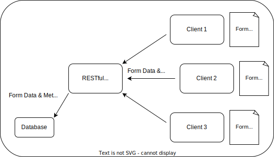
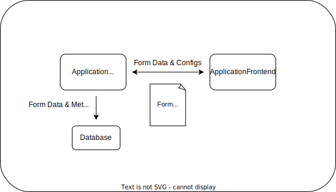

# libreForms Specification

## Contents
1. [Overview](#overview)
    1. [Definitions](#definitions)
    2. [Architecture](#architecture)
    3. [Assumptions](#assumptions)
    4. [Security](#security)
    5. [Principles](#principles)
        1. [Flat data](#flat-data)
        2. [Future-proof](#future-proof)
        3. [Default values](#default-values)
2. [Form Configuration Language](#form-configuration-language)
    1. [Form Fields](#form-fields)
        1. [Input specifications](#input-specifications)
        2. [Output specifications](#output-specifications)
        3. [Field Configs](#field-configs)
    2. [Form Configs](#form-configs)
    3. [Reserved characters](#reserved-characters)
    4. [Examples](#examples)
        1. [Python dictionaries](#python-dictionaries)
        2. [YAML](#yaml)
        3. [JSON](#json)
3. [Communication Protocol](#communication-protocol)
    1. [Metadata](#metadata)
    2. [HTTP Requests](#http-requests)


## Overview

This document describes the libreForms API, a form configuration language, and associated communication protocol built on HTTP requests, optimized for managing institutional forms over a network. 

Modern bureaucracies often rely on complex processes,typically built around the idea of standardized institutional forms, that tend to <a href="https://www.youtube.com/watch?v=JtEkUmYecnk" name="The 12 Tasks of Asterix: The Place That Sends You Mad">send you mad</a>. In more technical language, institutional form data has a tendency to require multiple users with varying institutional roles to repeatedly access and modify individual records of form data in processes that vary in their formality and clarity, and which tend to change over time. The libreForms API is purpose-built to manage data in such environments while keeping forms simple and flexible to changes in structure and process. 

At its core, the libreForms configuration language divides a form into its fields and configs. A field is an element of a form that an end user will generally see and interact with. Fields are generally composed of input and output specifications. Input specifications describe the type of field the end user will see and interact with. Output specifications describe the data type and/or structure that the field data will be treated as after the form is submitted. 

A config is an element of a form that an end user does not necessarily see or interact with, but which modifies the behavior of the form in the client. Configs are generally denoted in their name using some [reserved character](#reserved-characters), like a leading underscore, though implementers have significant flexibility to arbitrarily define the behavior resulting from the above rules. The following visualization gives an example of a traditional form (left) and that same form written as a libreForms form configuration (right).


<p align="center"></img></p>

After a form is submitted by an end user, the client will process the form data such that each field conforms to the data type described in its output specification. At this point, the form data can be communicated to a server over a network using HTTP requests. Because configs generally define behavior in the client, and as a result will not pass to the server, the same [reserved character](#reserved-characters) used for configs can be used for metadata that the server will store. This means that the server does not need to know the structure of the data, nor access a copy of the form configuration.

### Definitions

#### Form configuration

This term is used to refer to configuration files containing form-building data, as shown in the [examples](#examples) below. Unfortunately, this term may appear confusing when used alongside terms like [form configs](#form-configs), which refer to specific configurations applied on a form-by-form basis and employ [reserved characters](#reserved-characters) to set themselves apart from [form fields](#form-fields).

#### Distributed

This term is used to describe environments where form data is transferred over a network, for example using HTTP methods like `GET`, `PUT`, and `POST`, to allow web clients to communicate form data submitted by end users back to a server using approaches like REST or GraphQL.

#### Form data

This term refers to the data provided by end users when they prepare and submit forms.

#### Configs

This term refers to the data that is used to define behavior of forms, but which may not be visible to end users, especially at the client level.

#### Metadata

This term refers to the data, other than form data, that is passed to server (in distributed environments) and database to provide additional, contextualizing information about the form. Examples of metadata might include the source IP address, timestamp, or username of the submitter.


### Assumptions

The API carries with it a few implied assumptions.


#### Form data transferred using HTTP requests

This API presumes that form data will be transferred using HTTP requests when deployed in a server-client configuration. 

#### Form data collected using HTML forms

This API presumes that form data will be collected using HTML forms in the web client. 

#### Form data stored in schemaless databases

This API presumes that form data will be stored in a schemaless database, like a document database, to ensure that the server doesn't need to know the structure of the form data it is receiving ahead of time. In addition, this approach supports easy prototyping and changes to form configurations, without breaking the backend server or requiring a copy of the form configuration to reside there. 

#### Configs define behavior at the client level, but not necessarily beyond that

In distributed environments, the server may not know exactly what's happening at the client level. In fact, the more clients a server is receiving data from, the more generalized its interactions with them will probably need to be. To that end, this API presumes that configs will always apply to behavior at the client level, but that they might not apply to behavior at the server level - especially in distributed or RESTful environments. Instead, we treat data, other than form data, traded between server and client (and server and database) as metadata. 

#### Single reserved character employed for form configs, metadata, and deprecated form names

While there is no requirement that implementers only employ a single reserved character across the entire application, this API presumes that the same reserved character will be employed to designate form configs, form metadata, and form names that have been deprecated. 

### Architecture

This API is well-suited to a RESTful or distributed implementation, where various clients might manage different forms and employ different access controls, but store form data using a remote server accessed by API key. The use of reserved characters is especially useful in helping implementers build assumptions about the form data they will receive over the network: namely, that no data passed to the server that contains the reserved character in its name is form data, but instead can be treated as form metadata. This approach has the added benefit of decoupling the frontend form fields from the resultant backend data structures. Generally, RESTful approaches will store a separate, unique form configuration on each client, and the server will store minimal form configuration data, if any.



The API works just as effectively in an all-in-one application where the submission and processing of form data occur within the same application context, especially when administrators have a strong grasp of their form structure at the time of deployment. However, such situations seldom require the use of reserved characters to differentiate between form data and metadata, so the API design and its use of reserved characters may seem redundant in such environments. Unlike a RESTful approach, this architecture only requires a single form configuration, which is employed extensively by the application frontend and backend.




### Security

This API carries with it an implicit security concern regarding access to form data stored on the server by clients that have unscoped access to the data on the database.

- Control over scope at the server level
- Clients by default should not be able to see / query each other's form data - enforced through the API key scope
- Admin console or programmatically determine scope.
- clients handle auth at their level - within organizations, externalized auth (AD, OAUTH) highly recommended for consistency across clients (and consistency of the data stored on the backend, which does not clean up data by default)
- form configurations exist at the client level, and need not share with each other


API keys specifically require 

- scope determined at time API key token generated, and in subsequent modifications
    - automated API key generations must check scope and should grant access to the forms requested by client, and raise issues if it conflicts with existing form data
    - Recommended: manually-generated (eg. by admins using a CLI or admin console) API keys should have their scope modified as needed to account for changes to form names
- By default, clients granted scoped access to form `form_name` should also be given access to the deprecated version of that form name `_form_name`
- Migrations (eg. after changes to form names) will require direct action by administrators to modify the database and scoped access granted to the client API keys

### Principles

The libreForms API is a generalization that allows organizations to define every aspect of their forms. Legacy tools for managing institutional form data, like hand-signed and PDF documents, are incompatible with the modern need to manage form data at scale without significantly increasing administrative burden. Most browser-based form managers give form administrators little control over form fields, the resulting data, or the underlying web application. Proprietary solutions seldom provide self-hosting support, access to the source code, and a viable licensing model.

The libreForms API is written to prioritize customization, ease of use, and control. It uses a declarative approach to define forms and employs a relatively flat data structure to minimize the complexity, and maximize the readability, of form configurations. It leaves significant freedom to implementers to allow arbitrary form customization and tight control over the resultant form data, while encouraging implementers to make extensive use of default values to reduce boilerplate.

#### Flat data
This approach generally tries to avoid nesting data in an effort to reduce the complexity of the form configurations that it produces. It accomplishes this through a judicious use of reserved characters, typically the underscore. At the same time, its declarative approach helps avoid repetition. This simplicity and predictability may also have the added benefit of improving the human-readability of form configurations. 

#### Future-proof
The flexibility and abstractness of this approach goes a long way to making it future proof. However, there are some limits to this approach: first, form field inputs are rather tightly coupled with web-based forms; second, form field outputs are generally structured to conform to most relational and document databases; third, the use of reserved characters is most effective when data is being transferred over a network using approaches like REST, while it might not be as well-optimized for other environments.

#### Default values
This approach places a heavy emphasis on clearly-defined default behavior to serve as gap-fillers when form and field configs are left unspecified. This allows for predictable behavior and reduces boilerplate and general verbosity in the form configuration, but increases the work of implementers to robustly define default behavior for end users.

## Form Configuration Language


### Form Fields

These components define the structure of the form data generated from end user input. Each form field should contain details about the input and output data, while optionally including more granular field config details.

#### Input specifications

This component defines how the form field will appear to the client. For example, on web-based implementations, this will provide details about the HTML field that it will generate, including the input type, its description, whether it's required, its default values, or a list of available options.

#### Output specifications

This component defines how the form data will be parsed by the server. For example, on web-based implementations, this will provide details on what type or structure the data should conform to and any conditions that the data should pass, like length or character requirements.

#### Field Configs

This component defines granular behavior for a given form field. For example, on web-based implementations, this could provide details on which user groups are able to see a form field, whether the visibility or available options should depend on the values of another form field, whether to visually group this field with other fields, and whether this form field should be used to trigger some other behavior in the underlying implementation.

### Form Configs

These components define form behavior at the client and application level, but are not generally made visible to users. For example, they might be used to define how form data can be visualized, what user groups or roles are able to submit forms or view others' submitted forms, or whether to route form submissions through an approval process.

### Reserved characters

As discussed above, this approach relies heavily upon the judicious use of reserved characters to denote aspects of the form that should not be made visible to end users but rather parsed in some other way. Typically, a leading underscore is used but can be replaced by implementers with a character better suited to their needs. This reserved character should be employed in form configs and field configs but never employed in form names or field names.

This approach allows implementers to build a few assumptions into how they manage their forms. First, knowing that form field data will never contain the reserved character in the leading position allows the application backend to employ that character for its own metadata, which may significantly overlap with or differ from the form and field configs, when writing to the database. 

For example, let's say an implementer is employing a Document database to store form data. They want to store a nested metadata field, which they don't want to be treated like actual form data. They can add a field called `_metadata` during form post-processing with the confidence that this will not collide with any form fields. This is especially useful when you do not know the structure of the form data you are managing at the time of implementation.

In addition, since form names should never contain the reserved character in the leading position, implementers can use this to retire forms submissions or mark them for deletion without removing them from the database entirely (`move COLLECTION.SUBMISSION_ID to _COLLECTION`), removing it from the collection of forms that will be parsed by the application. 

Field names should never include the reserved character in the leading position to ensure they are not incorrectly parsed as configs by the application.

### Examples

Here are some example forms implemented with different approaches, where configs are denoted using leading underscores. Note `Pass_Field` has a field-specific configs, which theoretically makes the field's appearance depend on a specific value in `Radio_Field`. Further, `Text_Field` includes a condition that the output data must be at least six characters long.

#### python dictionaries

```python
forms = {
    "sample-form": {
        "Text_Field": {
            "input_field": {"type": "text", "content": ["NA"], "required": False,},
            "output_data": {"type": "str", "validators": [lambda p: len(p) >= 6],},
            '_description': "this is a text field",
        },
        "Pass_Field": {
            "input_field": {"type": "password", "content": [""], "required": False,},
            "output_data": {"type": "str", "validators": [],},
            "_depends_on": ("Radio_Field", "Option"),
            '_description':  "this is a password field",
        },
        "Radio_Field": {
            "input_field": {"type": "radio", "content": ["Pick", "An", "Option"], "required": False,},
            "output_data": {"type": "str", "validators": [],},
            '_description': "this is a radio field",
        },
        "Select_Field": {
            "input_field": {"type": "select", "content": ["Pick", "An", "Option"], "required": False,},
            "output_data": {"type": "str", "validators": [],},
            '_description': "this is a select / dropdown field",
        },
        "Check_Field": {
            "input_field": {"type": "checkbox", "content": ["Pick", "An", "Option"], "required": False,},
            "output_data": {"type": "list", "validators": [],},
            '_description': "this is a checkbox field",
        },
        "Date_Field": {
            "input_field": {"type": "date", "content": [], "required": False,},
            "output_data": {"type": "str", "validators": [],},
            '_description': "this is a date field",
        },
        "Hidden_Field": {
            "input_field": {"type": "hidden", "content": ["This field is hidden"], "required": False,},
            "output_data": {"type": "str", "validators": [],},
            '_description': "this is a hidden field",
        },
        "Float_Field": {
            "input_field": {"type": "number", "content": [0], "required": False,},
            "output_data": {"type": "float", "validators": [],},
            '_description': "this is a float field"
        }, 
        "Int_Field": {
            "input_field": {"type": "number", "content": [0], "required": False,},
            "output_data": {"type": "int", "validators": [],},
            '_description': "this is an int field",
        }, 
        "File_Field": {
            "input_field": {"type": "file", "content": [None]}, 
            "output_data": {"type": 'string', "validators": [],},
            '_description': "this is a file upload field"
        },
        "_dashboard": {                 
            "type": "scatter",           
            "fields": {                  
                "x": "Timestamp", 
                "y": "Int_Field",       
                "color": "Text_Field"
            },
        },
        "_allow_repeat": False, 
        "_description": "This is an example form.", 
        "_allow_anonymous_access": False, 
        "_allow_uploads": True, 
        "_allow_csv_templates": True, 
        "_suppress_default_values": False, 
    },
}
```

#### YAML

```yaml
sample-form:
  Check_Field:
    input_field:
      content:
      - Pick
      - An
      - Option
      required: false
      type: checkbox
    output_data:
      type: list
    _description: this is a checkbox field
  Date_Field:
    input_field:
      content: 
      - ''
      required: false
      type: date
    output_data:
      type: str
    _description: this is a date field
  File_Field:
    input_field:
      content:
      - null
      type: file
    output_data:
      type: string
    _description: this is a file upload field
  Float_Field:
    input_field:
      content:
      - 0
      required: false
      type: number
    output_data:
      type: float
    _description: this is a float field
  Hidden_Field:
    input_field:
      content:
      - This field is hidden
      required: false
      type: hidden
    output_data:
      type: str
    _description: this is a hidden field
  Int_Field:
    input_field:
      content:
      - 0
      required: false
      type: number
    output_data:
      type: int
    _description: this is an int field
  Pass_Field:
    input_field:
      content:
      - ''
      required: false
      type: password
    output_data:
      type: str
    _depends_on:
      Radio_Field: Option
    _description: this is a password field
  Radio_Field:
    input_field:
      content:
      - Pick
      - An
      - Option
      required: false
      type: radio
    output_data:
      type: str
    _description: this is a radio field
  Select_Field:
    input_field:
      content:
      - Pick
      - An
      - Option
      required: false
      type: select
    output_data:
      type: str
    _description: this is a select / dropdown field
  Text_Field:
    input_field:
      content:
      - NA
      required: false
      type: text
    output_data:
      type: str
      validators:
      - min_length: 6
    _description: this is a text field
  _dashboard:
    fields:
      color: Text_Field
      x: Timestamp
      y: Int_Field
    type: scatter
  _allow_anonymous_access: false
  _allow_csv_templates: true
  _allow_repeat: false
  _allow_uploads: true
  _description: This is an example form.
  _suppress_default_values: false
```

#### JSON

```javascript
{
  "sample-form": {
    "Check_Field": {
      "input_field": {
        "content": [
          "Pick",
          "An",
          "Option"
        ],
        "required": false,
        "type": "checkbox"
      },
      "output_data": {
        "type": "list"
      },
      "_description": "this is a checkbox field"
    },
    "Date_Field": {
      "input_field": {
        "content": [
          ""
        ],
        "required": false,
        "type": "date"
      },
      "output_data": {
        "type": "str"
      },
      "_description": "this is a date field"
    },
    "File_Field": {
      "input_field": {
        "content": [
          null
        ],
        "type": "file"
      },
      "output_data": {
        "type": "string"
      },
      "_description": "this is a file upload field"
    },
    "Float_Field": {
      "input_field": {
        "content": [
          0
        ],
        "required": false,
        "type": "number"
      },
      "output_data": {
        "type": "float"
      },
      "_description": "this is a float field"
    },
    "Hidden_Field": {
      "input_field": {
        "content": [
          "This field is hidden"
        ],
        "required": false,
        "type": "hidden"
      },
      "output_data": {
        "type": "str"
      },
      "_description": "this is a hidden field"
    },
    "Int_Field": {
      "input_field": {
        "content": [
          0
        ],
        "required": false,
        "type": "number"
      },
      "output_data": {
        "type": "int"
      },
      "_description": "this is an int field"
    },
    "Pass_Field": {
      "input_field": {
        "content": [
          ""
        ],
        "required": false,
        "type": "password"
      },
      "output_data": {
        "type": "str"
      },
      "_depends_on": {
        "Radio_Field": "Option"
      },
      "_description": "this is a password field"
    },
    "Radio_Field": {
      "input_field": {
        "content": [
          "Pick",
          "An",
          "Option"
        ],
        "required": false,
        "type": "radio"
      },
      "output_data": {
        "type": "str"
      },
      "_description": "this is a radio field"
    },
    "Select_Field": {
      "input_field": {
        "content": [
          "Pick",
          "An",
          "Option"
        ],
        "required": false,
        "type": "select"
      },
      "output_data": {
        "type": "str"
      },
      "_description": "this is a select / dropdown field"
    },
    "Text_Field": {
      "input_field": {
        "content": [
          "NA"
        ],
        "required": false,
        "type": "text"
      },
      "output_data": {
        "type": "str",
        "validators": [
          {
            "min_length": 6
          }
        ]
      },
      "_description": "this is a text field"
    },
    "_dashboard": {
      "fields": {
        "color": "Text_Field",
        "x": "Timestamp",
        "y": "Int_Field"
      },
      "type": "scatter"
    },
    "_allow_anonymous_access": false,
    "_allow_csv_templates": true,
    "_allow_repeat": false,
    "_allow_uploads": true,
    "_description": "This is an example form.",
    "_suppress_default_values": false
  }
}
```


## Communication Protocol


### Metadata

In the configuration language defined above, reserved characters are used to designate configs at the client level but, since these are not expected to extend beyond the client, the same reserved characters can be used to designate metadata when data is passed to the server and database.

This approach can be applied flexibly. For example, the following data structure nests the majority of the metadata fields under a `_Metadata` parent field. 

```json
{
  "_id": "63c48bc4c953a17a2622511e",
  "Link": "https://products.example.com/sd/0skdass-kms3",
  "Cost": "$19.99",
  "Comments": "This item is needed to support ongoing efforts to develop an autonomous trash collection drone",
  "Item": "Servo motor kit",
  "Program": "Robotics",
  "Project": "GarbageDrone",
  "_Metadata": {
    "Reporter": "smithj",
    "IP_Address": "92.28.144.72",
    "Timestamp": "2023-01-15 23:27:00.900567",
    "Owner": "smithj",
  }
}
```

However, this metadata could also be handled without nesting by simply prepending each field name with the reserved character.

```json
{
  "_id": "63c48bc4c953a17a2622511e",
  "Link": "https://products.example.com/sd/0skdass-kms3",
  "Cost": "$19.99",
  "Comments": "This item is needed to support ongoing efforts to develop an autonomous trash collection drone",
  "Item": "Servo motor kit",
  "Program": "Robotics",
  "Project": "GarbageDrone",
  "_Reporter": "smithj",
  "_IP_Address": "92.28.144.72",
  "_Timestamp": "2023-01-15 23:27:00.900567",
  "_Owner": "smithj",
}
```

Both approaches may work well, depending on the taste of the implementer and their preferred methods of accessing form metadata.

### HTTP Requests

Given the above approach for handling metadata, data traded over a network using HTTP requests should conform to the same rules. Form data should not include the reserved character, and metadata should. Take the following example of a PUT request using the Python requests library, which gives an example of how data may move from client to server in a distributed or RESTful environment.

```python

url = 'https://example.libreforms.com/api/u_M1rbaa76VeJOzrDVQjQA/budget_request/create'
data = {
  "Link": "https://products.example.com/sd/0skdass-kms3",
  "Cost": "$19.99",
  "Comments": "This item is needed to support ongoing efforts to develop an autonomous trash collection drone",
  "Item": "Servo motor kit",
  "Program": "Robotics",
  "Project": "GarbageDrone",
  "_Reporter": "smithj",
  "_IP_Address": "92.28.144.72",
  "_Timestamp": "2023-01-15 23:27:00.900567",
  "_Owner": "smithj",
}

x = requests.put(url, data)
```
